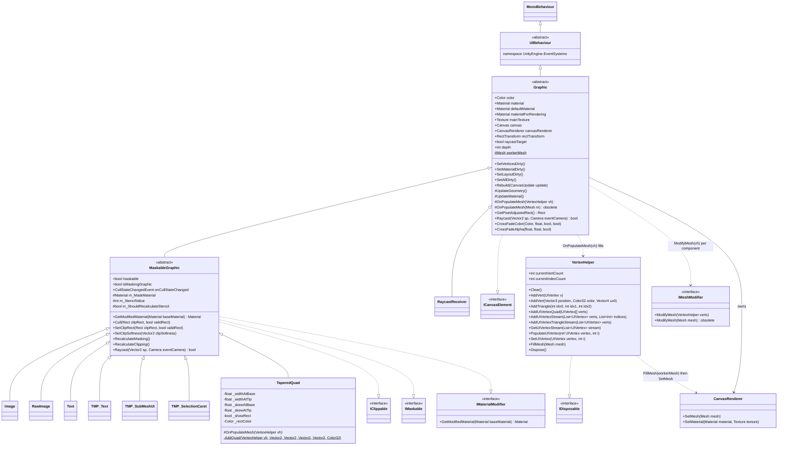

## class diagram for personal reminder

so i wont forget in the future lol

```mermaid
classDiagram
    direction TB

    class MonoBehaviour

    class UIBehaviour {
        <<abstract>>
        namespace UnityEngine.EventSystems
    }

    class Graphic {
        <<abstract>>
        +Color color
        +Material material
        +Material defaultMaterial
        +Material materialForRendering
        +Texture mainTexture
        +Canvas canvas
        +CanvasRenderer canvasRenderer
        +RectTransform rectTransform
        +bool raycastTarget
        +int depth
        #Mesh workerMesh$
        +SetVerticesDirty()
        +SetMaterialDirty()
        +SetLayoutDirty()
        +SetAllDirty()
        +Rebuild(CanvasUpdate update)
        #UpdateGeometry()
        #UpdateMaterial()
        #OnPopulateMesh(VertexHelper vh)
        #OnPopulateMesh(Mesh m) obsolete
        +GetPixelAdjustedRect() Rect
        +Raycast(Vector2 sp, Camera eventCamera) bool
        +CrossFadeColor(Color, float, bool, bool)
        +CrossFadeAlpha(float, float, bool)
    }

    class MaskableGraphic {
        <<abstract>>
        +bool maskable
        +bool isMaskingGraphic
        +CullStateChangedEvent onCullStateChanged
        #Material m_MaskMaterial
        #int m_StencilValue
        #bool m_ShouldRecalculateStencil
        +GetModifiedMaterial(Material baseMaterial) Material
        +Cull(Rect clipRect, bool validRect)
        +SetClipRect(Rect clipRect, bool validRect)
        +SetClipSoftness(Vector2 clipSoftness)
        +RecalculateMasking()
        +RecalculateClipping()
        +Raycast(Vector2 sp, Camera eventCamera) bool
    }

    class RaycastReceiver
    class Image
    class RawImage
    class Text
    class TMP_Text
    class TMP_SubMeshUI
    class TMP_SelectionCaret

    class TaperedQuad {
        -float _widthAtBase
        -float _widthAtTip
        -float _skewAtBase
        -float _skewAtTip
        -bool _showRect
        -Color _rectColor
        #OnPopulateMesh(VertexHelper vh)
        -AddQuad(VertexHelper vh, Vector2, Vector2, Vector2, Vector2, Color32)$
    }

    class VertexHelper {
        +int currentVertCount
        +int currentIndexCount
        +Clear()
        +AddVert(UIVertex v)
        +AddVert(Vector3 position, Color32 color, Vector4 uv0)
        +AddTriangle(int idx0, int idx1, int idx2)
        +AddUIVertexQuad(UIVertex[] verts)
        +AddUIVertexStream(List~UIVertex~ verts, List~int~ indices)
        +AddUIVertexTriangleStream(List~UIVertex~ verts)
        +GetUIVertexStream(List~UIVertex~ stream)
        +PopulateUIVertex(ref UIVertex vertex, int i)
        +SetUIVertex(UIVertex vertex, int i)
        +FillMesh(Mesh mesh)
        +Dispose()
    }

    class IDisposable {
        <<interface>>
    }
    class ICanvasElement {
        <<interface>>
    }
    class IClippable {
        <<interface>>
    }
    class IMaskable {
        <<interface>>
    }
    class IMaterialModifier {
        <<interface>>
        +GetModifiedMaterial(Material baseMaterial) Material
    }
    class IMeshModifier {
        <<interface>>
        +ModifyMesh(VertexHelper verts)
        +ModifyMesh(Mesh mesh) obsolete
    }
    class CanvasRenderer {
        +SetMesh(Mesh mesh)
        +SetMaterial(Material material, Texture texture)
    }

    MonoBehaviour <|-- UIBehaviour
    UIBehaviour <|-- Graphic
    Graphic <|-- MaskableGraphic
    Graphic <|-- RaycastReceiver
    MaskableGraphic <|-- Image
    MaskableGraphic <|-- RawImage
    MaskableGraphic <|-- Text
    MaskableGraphic <|-- TMP_Text
    MaskableGraphic <|-- TMP_SubMeshUI
    MaskableGraphic <|-- TMP_SelectionCaret
    MaskableGraphic <|-- TaperedQuad

    Graphic ..|> ICanvasElement
    MaskableGraphic ..|> IClippable
    MaskableGraphic ..|> IMaskable
    MaskableGraphic ..|> IMaterialModifier
    VertexHelper ..|> IDisposable

    Graphic ..> VertexHelper : OnPopulateMesh(vh) fills
    Graphic ..> IMeshModifier : ModifyMesh(vh) per component
    Graphic --> CanvasRenderer : owns
    VertexHelper ..> CanvasRenderer : FillMesh(workerMesh) then SetMesh
```
